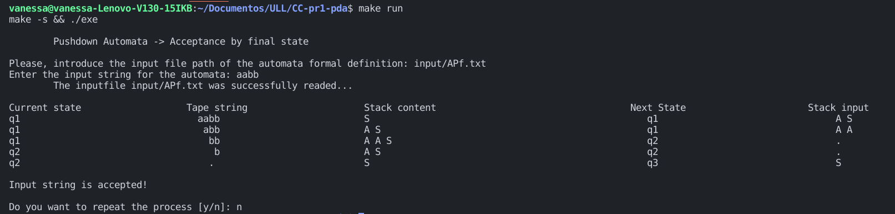

# **Práctica 1 - Implementar un autómata con pila**
#### Asignatura: Complejidad Computacional
#### Autora: Vanessa Valentina Villalba Pérez alu0101265704@ull.edu.es

### **Implementación realizada: Autómata con pila por estados finales**
### **Objetivo de la entrega**
* Programar un simulador de un autómata con pila, realizando un diseño orientado a objetos.
  

### **Ejecución del programa**
* Para poder ejecutar el programa se ha de ejecutar el siguiente comando:
```
make run
```
* Seguidamente, el programa le pedirá que introduzca el path correspondiente al fichero con la definición formal del autómata a utilizar. Por ejemplo: [input/APf.txt](input/APf.txt)
* Luego, se deberá introducir la cadena de entrada para la cinta del autómata. Por ejemplo: aabb.
* Se mostrará por consola la traza de las diferentes transiciones por las que ha transitado el PDA y, le preguntará si desea repetir la ejecución, donde podrá responder **y** o **n** (si o no, respectivamente).

### **Limpieza tras compilación**
```
make clean
```

### Estructura de ficheros
```
.
├── exe
├── include
│   ├── Alphabet.h
│   ├── PDA.h
│   ├── State.h
│   ├── Symbol.h
│   └── Transition.h
├── input
│   ├── APf-2.txt
│   └── APf.txt
├── LICENSE
├── Makefile
├── obj
│   ├── Main.o
│   ├── PDA.o
│   └── Symbol.o
├── Practica1_2122.pdf
├── README.md
└── src
    ├── Alphabet.cc
    ├── Main.cc
    ├── PDA.cc
    ├── State.cc
    ├── Symbol.cc
    └── Transition.cc
```
